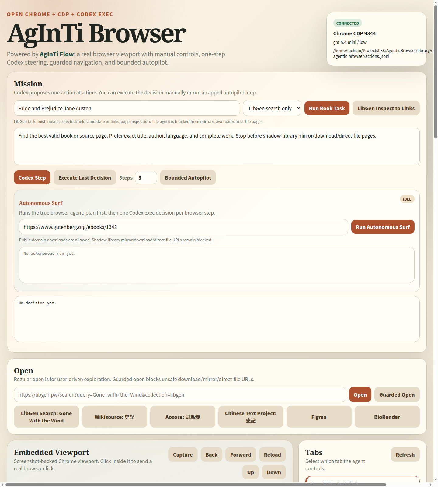

[English](README.md) · [العربية](i18n/README.ar.md) · [Español](i18n/README.es.md) · [Français](i18n/README.fr.md) · [日本語](i18n/README.ja.md) · [한국어](i18n/README.ko.md) · [Tiếng Việt](i18n/README.vi.md) · [中文 (简体)](i18n/README.zh-Hans.md) · [中文（繁體）](i18n/README.zh-Hant.md) · [Deutsch](i18n/README.de.md) · [Русский](i18n/README.ru.md)

<p align="center">
  <a href="https://lazying.art">
    
  </a>
</p>

<h1 align="center">AgInTi Browser</h1>

<p align="center">
  <strong>A local-first Chrome/CDP browser workbench for human-supervised AI browsing, powered by AgInTi Flow.</strong>
</p>

<p align="center">
  <a href="assets/agentic-browser-webapp.png">
    
  </a>
</p>

<p align="center">
  <a href="https://lazying.art"></a>
  <a href="https://flow.lazying.art"></a>
  <a href="https://www.npmjs.com/package/@lazyingart/aginti-browser"></a>
  <a href="https://github.com/lachlanchen/aginti-browser"></a>
  
  
</p>

AgInTi Browser is a practical browser automation tool built around real Chrome or Chromium, Chrome DevTools Protocol, and a Codex-compatible command wrapper. It gives the human a visible webapp, a clickable screenshot viewport, DOM observations, a CLI, tmux-friendly service management, and an autonomous surfing loop where every step is bounded and logged.

It is not a browser engine from scratch. It is a controlled browser workbench: real websites run inside real Chrome, while the local app observes screenshots and DOM state, asks an agent for one action, enforces safety rules, and executes that action through CDP.

AgInTi Browser acknowledges and is powered by [AgInTi Flow](https://flow.lazying.art), an agentic workflow system from [LazyingArt LLC](https://lazying.art).

## What It Does

- Opens a local webapp for manual and agentic browsing control.
- Launches or attaches to Chrome/Chromium through Chrome DevTools Protocol.
- Shows a live screenshot-backed viewport that you can click, scroll, type into, reload, and navigate.
- Combines screenshot state with DOM elements, links, cards, visible text, and page policy.
- Provides `codex exec` powered one-step steering and a capped autonomous surf loop.
- Provides a CLI/REPL so webapp and terminal can control the same browser service.
- Runs in normal visible Chrome, a contained Xephyr window, or headless mode.
- Supports guarded public-domain downloads and blocks shadow-library mirror/download/direct-file navigation.
- Writes action logs and autonomous run logs under `library/`.

## Quick Start

```bash
git clone https://github.com/lachlanchen/aginti-browser.git
cd agentic-browser
python3 -m pip install -r requirements.txt
./run-agentic-browser-vdesktop.sh start
```

Then open:

```text
http://127.0.0.1:8794
```

The default virtual desktop mode is visible Xephyr. The controlled Chrome opens
target websites inside one contained virtual-desktop window, while the webapp
also shows the same selected tab through its screenshot and DOM panels.

## npm Install

AgInTi Browser is packaged as `@lazyingart/aginti-browser`.

```bash
npm install -g @lazyingart/aginti-browser
python3 -m pip install websocket-client
aginti-browser service start
```

Then open:

```text
http://127.0.0.1:8794
```

The npm package exposes both command names:

```bash
aginti-browser --help
agentic-browser --help
```

Future npm releases use GitHub trusted publishing, so local npm login, OTP, browser confirmation, and npm tokens are not needed:

```bash
npm run release:npm -- patch
```

The first publish has already been bootstrapped and npm trust is configured for `lachlanchen/aginti-browser`. For local token fallback, put `NPM_TOKEN` or `NODE_AUTH_TOKEN` in `.env`, or point at an existing trusted env file:

```bash
AGINTI_BROWSER_NPM_ENV=/home/lachlan/ProjectsLFS/Agent/AgInTiFlow/.env npm run publish:env:whoami
AGINTI_BROWSER_NPM_ENV=/home/lachlan/ProjectsLFS/Agent/AgInTiFlow/.env npm run publish:env

AGINTI_BROWSER_NPM_ENV=/home/lachlan/ProjectsLFS/AAPS/.env npm run publish:env:whoami
```

Trusted publishing is preferred for repeat releases because it avoids local OTPs and long-lived npm publish tokens. The local publish helper creates a temporary `.npmrc`, never prints the token, and removes the temporary file after npm exits. See `docs/npm-publishing.md`.

## Main Commands

```bash
./agentic-browser status
./agentic-browser open --guarded https://example.com
./agentic-browser observe
./agentic-browser goal --start-url https://example.com --max-steps 4 "Extract the visible page title and stop."
./agentic-browser goal --max-steps 6 "Search a book on LibGen: A Concise History of Japan Brett Walker. Choose the best English candidate and stop before any mirror or download page."
./agentic-browser chat
```

Run the webapp directly:

```bash
./run-embedded-agentic-browser.sh
```

Run a standalone app-mode shell:

```bash
./run-agentic-browser-app.sh
```

Run the process-level agent without the GUI:

```bash
./run-true-agentic-browser.sh \
  --goal "Open the page, read the visible title, and stop." \
  --start-url "https://example.com" \
  --max-steps 4
```

## Runtime Modes

| Mode | Use Case | Command |
| --- | --- | --- |
| Xephyr | Default. One contained nested desktop window, so you can see the controlled Chrome itself | `./run-agentic-browser-vdesktop.sh start` |
| Headless | No visible controlled browser window; best for background work | `AGENTIC_VDESKTOP_MODE=headless ./run-agentic-browser-vdesktop.sh start` |
| Xvfb | Fully off-screen X desktop when Xvfb is installed | `AGENTIC_VDESKTOP_MODE=xvfb ./run-agentic-browser-vdesktop.sh start` |
| Direct | Local webapp and normal controlled Chrome profile | `./run-embedded-agentic-browser.sh` |

## Architecture

```text
Webapp / CLI
    |
    v
Local HTTP API
    |
    +-- CDP driver -> Chrome/Chromium tab
    |
    +-- Observation -> screenshot + DOM + policy
    |
    +-- Codex wrapper -> one bounded JSON action
    |
    +-- Safety guard -> allow / block / hold
    |
    v
Action log + autonomous run log
```

Core files:

- `embedded_agentic_browser/server.py`: webapp/API service.
- `embedded_agentic_browser/open_chrome_driver.py`: Chrome DevTools Protocol driver.
- `embedded_agentic_browser/agent.py`: autonomous surf runtime.
- `embedded_agentic_browser/safety.py`: navigation and download policy.
- `agentic_browser_cli.py`: terminal client and REPL.
- `run-agentic-browser-vdesktop.sh`: tmux + virtual display launcher.
- `docs/AGENTIC_BROWSER_GUIDE.md`: detailed implementation notes.
- `docs/npm-publishing.md`: npm install and LazyingArt publish workflow.
- `legacy/`: older prototype GUI kept as a reference.

## Safety Boundary

The browser can inspect normal pages, public-domain/open sources, and design tools such as Figma or BioRender under the local user’s own browser session. It does not bypass login, paywalls, access control, or site restrictions.

Guarded agent actions block shadow-library mirror/download/direct-file URLs and non-public direct binary downloads. Public-domain/open downloads can be allowed when the user explicitly asks for them.

## Test

```bash
npm test
python3 -m unittest discover -s embedded_agentic_browser/tests
npm pack --dry-run
```

Current copied validation from the source workspace:

- Webapp-driven Xephyr/windowed browsing worked through `http://127.0.0.1:8794`.
- Webapp-driven headless browsing also worked when explicitly requested.
- CLI/API smoke tests worked for `status`, `open`, `observe`, and autonomous `goal`.
- Unit suite: `48` tests passing.

## Project Lineage

This repo was extracted from a book/workflow automation workspace into a standalone AgInTi Browser project. Future AgInTi Browser development should happen here, not inside the Books repo.

AgInTi Browser is part of the LazyingArt LLC agentic tooling family and acknowledges AgInTi Flow as its workflow foundation:

- AgInTi Flow: https://flow.lazying.art
- LazyingArt LLC: https://lazying.art
- GitHub: https://github.com/lachlanchen

## Support

| Donate | PayPal | Stripe |
| --- | --- | --- |
| [](https://chat.lazying.art/donate) | [](https://paypal.me/RongzhouChen) | [](https://buy.stripe.com/aFadR8gIaflgfQV6T4fw400) |

## Contact

[](https://github.com/lachlanchen)
[](mailto:lach@lazying.art)

Build less. Live more.
